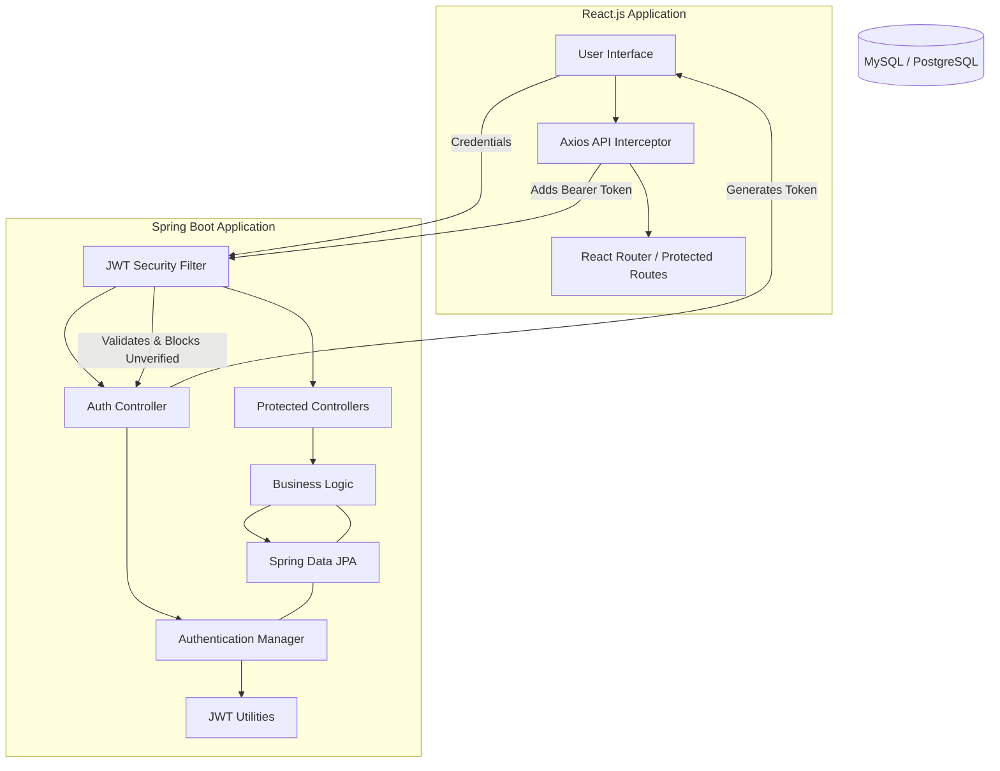
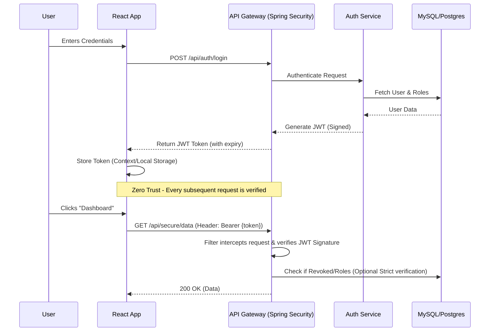

# A Zero-Trust Driven Web Authentication Framework
**Complete Project Plan & Implementation Guide**

---

## 🌟 Vision & Mission

**Vision:** To build a secure, reusable, and developer-friendly authentication framework that promotes Zero Trust security principles in modern web applications.

**Mission:**
1. Implement a secure authentication system that verifies every request using the Zero Trust model.
2. Provide JWT-based stateless authentication with role-based access control (RBAC).
3. Design modular components so the authentication system can be reused across multiple projects.
4. Enable developers to integrate the framework easily with minimal configuration.
5. Demonstrate the working framework through a sample web application and documentation.

---

## 1. System Architecture Design

The architecture enforces "Never Trust, Always Verify." The React Frontend communicates with the Spring Boot Backend exclusively through a RESTful API. Every request must pass through a Security Filter Chain validating the JWT.



---

## 2. Authentication Workflow



---

## 3. Project Folder Structure

A standardized, modular folder structure ensures reusability.

### Backend Structure (Spring Boot)
```text
src/main/java/com/zerotrust/auth/
├── ZeroTrustAuthApplication.java
├── config/
│   └── SecurityConfig.java         # Master security firewall rules
├── controller/
│   ├── AuthController.java         # Public auth endpoints
│   └── DemoController.java         # Protected usage examples
├── security/                       # **REUSABLE AUTH MODULE**
│   ├── JwtAuthFilter.java          # Interceptor for zero-trust checks
│   ├── JwtUtils.java               # Token generation, extraction, signing
│   ├── UserDetailsImpl.java        # User projection
│   └── UserDetailsServiceImpl.java # DB integration for auth
├── model/
│   ├── User.java
│   └── Role.java
├── repository/
│   └── UserRepository.java
└── payload/                        # DTOs
    ├── request/LoginRequest.java
    └── response/JwtResponse.java
```

### Frontend Structure (React)
```text
src/
├── api/
│   └── interceptor.js              # Injects JWT into headers globally
├── components/
│   ├── layout/
│   │   ├── Navbar.jsx
│   │   └── Navbar.css
│   ├── auth/
│   │   ├── Login.jsx               # Login UI
│   │   └── Login.css               
│   ├── routes/
│   │   └── ProtectedRoute.jsx      # Zero-trust enforcement on client UI
│   └── dashboard/
│       ├── Dashboard.jsx
│       └── Dashboard.css
├── context/
│   └── AuthContext.jsx             # Global authentication state
├── App.jsx
├── App.css
└── index.js
```

---

## 4. Reusable Authentication Components (Backend)

### A. Core JWT Utility (`JwtUtils.java`)
Generates, parses, and validates the tokens.

```java
package com.zerotrust.auth.security;

import io.jsonwebtoken.*;
import org.springframework.beans.factory.annotation.Value;
import org.springframework.security.core.Authentication;
import org.springframework.stereotype.Component;

import java.util.Date;

@Component
public class JwtUtils {
    @Value("${app.jwtSecret}")
    private String jwtSecret;

    @Value("${app.jwtExpirationMs}")
    private int jwtExpirationMs;

    public String generateJwtToken(Authentication authentication) {
        UserDetailsImpl userPrincipal = (UserDetailsImpl) authentication.getPrincipal();

        return Jwts.builder()
                .setSubject((userPrincipal.getUsername()))
                .setIssuedAt(new Date())
                .setExpiration(new Date((new Date()).getTime() + jwtExpirationMs))
                .signWith(SignatureAlgorithm.HS512, jwtSecret)
                .compact();
    }

    public String getUserNameFromJwtToken(String token) {
        return Jwts.parser().setSigningKey(jwtSecret).parseClaimsJws(token).getBody().getSubject();
    }

    public boolean validateJwtToken(String authToken) {
        try {
            Jwts.parser().setSigningKey(jwtSecret).parseClaimsJws(authToken);
            return true;
        } catch (SignatureException | MalformedJwtException | ExpiredJwtException | UnsupportedJwtException | IllegalArgumentException e) {
            System.err.println("Invalid JWT Signature/Token: " + e.getMessage());
        }
        return false;
    }
}
```

### B. Security Zero-Trust Filter (`JwtAuthFilter.java`)
Evaluates *every* incoming request.

```java
package com.zerotrust.auth.security;

import org.springframework.beans.factory.annotation.Autowired;
import org.springframework.security.authentication.UsernamePasswordAuthenticationToken;
import org.springframework.security.core.context.SecurityContextHolder;
import org.springframework.security.core.userdetails.UserDetails;
import org.springframework.security.web.authentication.WebAuthenticationDetailsSource;
import org.springframework.util.StringUtils;
import org.springframework.web.filter.OncePerRequestFilter;

import javax.servlet.FilterChain;
import javax.servlet.ServletException;
import javax.servlet.http.HttpServletRequest;
import javax.servlet.http.HttpServletResponse;
import java.io.IOException;

public class JwtAuthFilter extends OncePerRequestFilter {

    @Autowired
    private JwtUtils jwtUtils;

    @Autowired
    private UserDetailsServiceImpl userDetailsService;

    @Override
    protected void doFilterInternal(HttpServletRequest request, HttpServletResponse response, FilterChain filterChain)
            throws ServletException, IOException {
        try {
            String jwt = parseJwt(request);
            // Verify token FIRST - Core Zero Trust Principle
            if (jwt != null && jwtUtils.validateJwtToken(jwt)) {
                String username = jwtUtils.getUserNameFromJwtToken(jwt);
                UserDetails userDetails = userDetailsService.loadUserByUsername(username);

                UsernamePasswordAuthenticationToken authentication = new UsernamePasswordAuthenticationToken(
                        userDetails, null, userDetails.getAuthorities());
                authentication.setDetails(new WebAuthenticationDetailsSource().buildDetails(request));

                SecurityContextHolder.getContext().setAuthentication(authentication);
            }
        } catch (Exception e) {
            System.err.println("Cannot set user authentication: " + e);
        }
        filterChain.doFilter(request, response);
    }

    private String parseJwt(HttpServletRequest request) {
        String headerAuth = request.getHeader("Authorization");
        if (StringUtils.hasText(headerAuth) && headerAuth.startsWith("Bearer ")) {
            return headerAuth.substring(7); // Remove 'Bearer ' prefix
        }
        return null;
    }
}
```

### C. Master Firewall Configuration (`SecurityConfig.java`)
```java
package com.zerotrust.auth.config;

import com.zerotrust.auth.security.JwtAuthFilter;
import com.zerotrust.auth.security.UserDetailsServiceImpl;
import org.springframework.beans.factory.annotation.Autowired;
import org.springframework.context.annotation.Bean;
import org.springframework.context.annotation.Configuration;
import org.springframework.security.authentication.AuthenticationManager;
import org.springframework.security.config.annotation.authentication.builders.AuthenticationManagerBuilder;
import org.springframework.security.config.annotation.method.configuration.EnableGlobalMethodSecurity;
import org.springframework.security.config.annotation.web.builders.HttpSecurity;
import org.springframework.security.config.annotation.web.configuration.EnableWebSecurity;
import org.springframework.security.config.annotation.web.configuration.WebSecurityConfigurerAdapter;
import org.springframework.security.config.http.SessionCreationPolicy;
import org.springframework.security.crypto.bcrypt.BCryptPasswordEncoder;
import org.springframework.security.crypto.password.PasswordEncoder;
import org.springframework.security.web.authentication.UsernamePasswordAuthenticationFilter;

@Configuration
@EnableWebSecurity
@EnableGlobalMethodSecurity(prePostEnabled = true) // Promotes method-level Zero Trust
public class SecurityConfig extends WebSecurityConfigurerAdapter {

    @Autowired
    UserDetailsServiceImpl userDetailsService;

    @Bean
    public JwtAuthFilter authenticationJwtTokenFilter() {
        return new JwtAuthFilter();
    }

    @Override
    public void configure(AuthenticationManagerBuilder authenticationManagerBuilder) throws Exception {
        authenticationManagerBuilder.userDetailsService(userDetailsService).passwordEncoder(passwordEncoder());
    }

    @Bean
    @Override
    public AuthenticationManager authenticationManagerBean() throws Exception {
        return super.authenticationManagerBean();
    }

    @Bean
    public PasswordEncoder passwordEncoder() {
        return new BCryptPasswordEncoder();
    }

    @Override
    protected void configure(HttpSecurity http) throws Exception {
        http.cors().and().csrf().disable()
            // Make session stateless - no memory, pure Zero Trust validation per request
            .sessionManagement().sessionCreationPolicy(SessionCreationPolicy.STATELESS).and()
            .authorizeRequests().antMatchers("/api/auth/**").permitAll()
            .antMatchers("/api/public/**").permitAll()
            .anyRequest().authenticated(); // All other endpoints require validation

        http.addFilterBefore(authenticationJwtTokenFilter(), UsernamePasswordAuthenticationFilter.class);
    }
}
```

---

## 5. Example Secure APIs

### `AuthController.java`
```java
@CrossOrigin(origins = "*", maxAge = 3600)
@RestController
@RequestMapping("/api/auth")
public class AuthController {
    @Autowired
    AuthenticationManager authenticationManager;

    @Autowired
    JwtUtils jwtUtils;

    @PostMapping("/signin")
    public ResponseEntity<?> authenticateUser(@Valid @RequestBody LoginRequest loginRequest) {
        Authentication authentication = authenticationManager.authenticate(
                new UsernamePasswordAuthenticationToken(loginRequest.getUsername(), loginRequest.getPassword()));

        SecurityContextHolder.getContext().setAuthentication(authentication);
        String jwt = jwtUtils.generateJwtToken(authentication);
        
        // Return structured JwtResponse containing token and user profile
        return ResponseEntity.ok(new JwtResponse(jwt, "Login successful"));
    }
}
```

### `DemoController.java`
```java
@CrossOrigin(origins = "*", maxAge = 3600)
@RestController
@RequestMapping("/api/secure")
public class DemoController {
    
    // Explicit Role-Based Access Control inside Zero Trust framework
    @GetMapping("/admin-dashboard")
    @PreAuthorize("hasRole('ADMIN')")
    public String adminAccess() {
        return "Confidential Admin Configuration Data.";
    }

    @GetMapping("/user-profile")
    @PreAuthorize("hasRole('USER') or hasRole('ADMIN')")
    public String userAccess() {
        return "User Content Accessed Securely.";
    }
}
```

---

## 6. Frontend Protected Implementation (React)

### API Interceptor (`src/api/interceptor.js`)
Intercepts all outbound HTTP requests to automatically append the Bearer token.

```javascript
import axios from 'axios';

const api = axios.create({
    baseURL: 'http://localhost:8080/api',
});

api.interceptors.request.use(
    (config) => {
        const token = localStorage.getItem('token');
        if (token) {
            config.headers['Authorization'] = `Bearer ${token}`;
        }
        return config;
    },
    (error) => {
        return Promise.reject(error);
    }
);

// Optional: Intercept 401 Unauthorized to auto-logout
api.interceptors.response.use(
    (response) => response,
    (error) => {
        if (error.response && error.response.status === 401) {
            localStorage.removeItem('token');
            window.location.href = '/login';
        }
        return Promise.reject(error);
    }
);

export default api;
```

### Auth Context (`src/context/AuthContext.jsx`)
```javascript
import React, { createContext, useState, useEffect } from 'react';
import api from '../api/interceptor';

export const AuthContext = createContext();

export const AuthProvider = ({ children }) => {
    const [user, setUser] = useState(null);
    const [loading, setLoading] = useState(true);

    useEffect(() => {
        // Hydrate user state from valid token on initial load
        const token = localStorage.getItem('token');
        if (token) {
            setUser({ isAuthenticated: true });
        }
        setLoading(false);
    }, []);

    const login = async (username, password) => {
        try {
            const response = await api.post('/auth/signin', { username, password });
            localStorage.setItem('token', response.data.token);
            setUser({ isAuthenticated: true, ...response.data });
            return true;
        } catch (error) {
            console.error("Login failed", error);
            return false;
        }
    };

    const logout = () => {
        localStorage.removeItem('token');
        setUser(null);
    };

    return (
        <AuthContext.Provider value={{ user, login, logout, loading }}>
            {!loading && children}
        </AuthContext.Provider>
    );
};
```

### Login Component (`src/components/auth/Login.jsx`)
```jsx
// src/components/auth/Login.jsx
import React, { useState, useContext } from 'react';
import { AuthContext } from '../../context/AuthContext';
import { useNavigate } from 'react-router-dom';
import './Login.css';

const Login = () => {
    const [username, setUsername] = useState('');
    const [password, setPassword] = useState('');
    const [error, setError] = useState('');
    const { login } = useContext(AuthContext);
    const navigate = useNavigate();

    const handleSubmit = async (e) => {
        e.preventDefault();
        const success = await login(username, password);
        if (success) {
            navigate('/dashboard');
        } else {
            setError('Verification Failed. Invalid credentials.');
        }
    };

    return (
        <div className="login-container">
            <div className="login-card">
                <h2>Zero-Trust Access</h2>
                {error && <div className="error-alert">{error}</div>}
                <form onSubmit={handleSubmit}>
                    <div className="input-group">
                        <label>Identifier</label>
                        <input type="text" value={username} onChange={e => setUsername(e.target.value)} required />
                    </div>
                    <div className="input-group">
                        <label>Passphrase</label>
                        <input type="password" value={password} onChange={e => setPassword(e.target.value)} required />
                    </div>
                    <button type="submit" className="login-btn">Authenticate Request</button>
                </form>
            </div>
        </div>
    );
};

export default Login;
```
*(A separate `Login.css` will style the `.login-card` using modern, secure-feeling aesthetics e.g., dark mode/neon accents).*

### Protected Route (`src/components/routes/ProtectedRoute.jsx`)
Ensures no UI renders unless the user context indicates valid authentication.

```jsx
import React, { useContext } from 'react';
import { Navigate } from 'react-router-dom';
import { AuthContext } from '../../context/AuthContext';

const ProtectedRoute = ({ children }) => {
    const { user } = useContext(AuthContext);

    // Zero-Trust verification boundary on frontend
    if (!user || !user.isAuthenticated) {
        return <Navigate to="/login" replace />;
    }

    return children;
};

export default ProtectedRoute;
```

---

## 7. Example Demo Application (`App.jsx`)

```jsx
import React from 'react';
import { BrowserRouter as Router, Routes, Route } from 'react-router-dom';
import { AuthProvider } from './context/AuthContext';
import Login from './components/auth/Login';
import Dashboard from './components/dashboard/Dashboard';
import ProtectedRoute from './components/routes/ProtectedRoute';
import './App.css';

function App() {
    return (
        <AuthProvider>
            <Router>
                <Routes>
                    <Route path="/login" element={<Login />} />
                    
                    {/* ZERO-TRUST BOUNDARY */}
                    <Route 
                        path="/dashboard" 
                        element={
                            <ProtectedRoute>
                                <Dashboard />
                            </ProtectedRoute>
                        } 
                    />
                    
                    {/* Fallback */}
                    <Route path="*" element={<Login />} />
                </Routes>
            </Router>
        </AuthProvider>
    );
}

export default App;
```

---

## 8. GitHub Documentation Structure

To make this a highly acclaimed Open-Source software engineering project, structure your GitHub repository like this:

```
zerotrust-auth-framework/
├── README.md               # Main landing page (badges, overviews, quick-starts)
├── LICENSE                 # MIT or Apache 2.0
├── CONTRIBUTING.md         # Guide for other devs to contribute
├── SECURITY.md             # Instructions on reporting security vulnerabilities
├── backend/                # Spring Boot source code
│   └── README.md           # Backend specific run commands & DB config
├── frontend/               # React source code
│   └── README.md           # Frontend npm commands
└── docs/
    ├── architecture.md     # System architecture diagrams
    ├── api-endpoints.md    # Postman-style docs of the APIs
    └── zero-trust.md       # Essay/Research on why this uses the Zero-Trust model
```

---

## 9. Deployment Instructions 

### Part 1: Publishing on GitHub
1. Initialize Git in the project root: `git init`
2. Add a `.gitignore` to exclude `node_modules`, `target/`, and `.env` files.
3. Commit codebase: `git add .` -> `git commit -m "Initial Release: Zero-Trust Framework"`
4. Push to origin: `git remote add origin <repo-url>` -> `git push -u origin main`

### Part 2: Hosting the Framework
*   **Database**: Host PostgreSQL/MySQL on **Supabase**, **Neon**, or **AWS RDS** (ensure IP Allow-listing).
*   **Backend (Spring Boot)**: 
    *   Create a `Dockerfile` for the application.
    *   Deploy using a PaaS like **Render**, **Railway**, or **Heroku**.
    *   Set environment variables (e.g., `APP_JWT_SECRET`, `DB_URL`) in the platform dashboard securely.
*   **Frontend (React)**:
    *   Point API interceptor base URL to the deployed Backend API.
    *   Connect the frontend repo to **Vercel** or **Netlify** for automatic CI/CD deployment on every GitHub push.

---

## 10. Suggestions for Future Improvements

To elevate the framework beyond an academic project into enterprise-grade software, consider adding the following capabilities:

1. **Multi-Factor Authentication (MFA):** Integrate TOTP (Time-Based One Time Passwords) using Google Authenticator (via libraries like `aerogear-otp-java`) as a secondary verification step.
2. **Device Fingerprinting:** When issuing a JWT, capture device/browser heuristics. If the JWT is hijacked and used on an unfamiliar device, the backend immediately invalidates it.
3. **API Rate Limiting:** Introduce **Bucket4j** + Redis to limit the number of requests per IP, stopping brute-force and DDoS attacks.
4. **Token Revocation Blacklist:** Since JWTs are stateless, create a Redis blacklist table for logged-out or compromised tokens before their natural expiry time.
5. **HttpOnly Cookies:** Transition from `localStorage` token storage to strict `HttpOnly`, `Secure`, `SameSite=Strict` cookies to mitigate Cross-Site Scripting (XSS) risks entirely.
